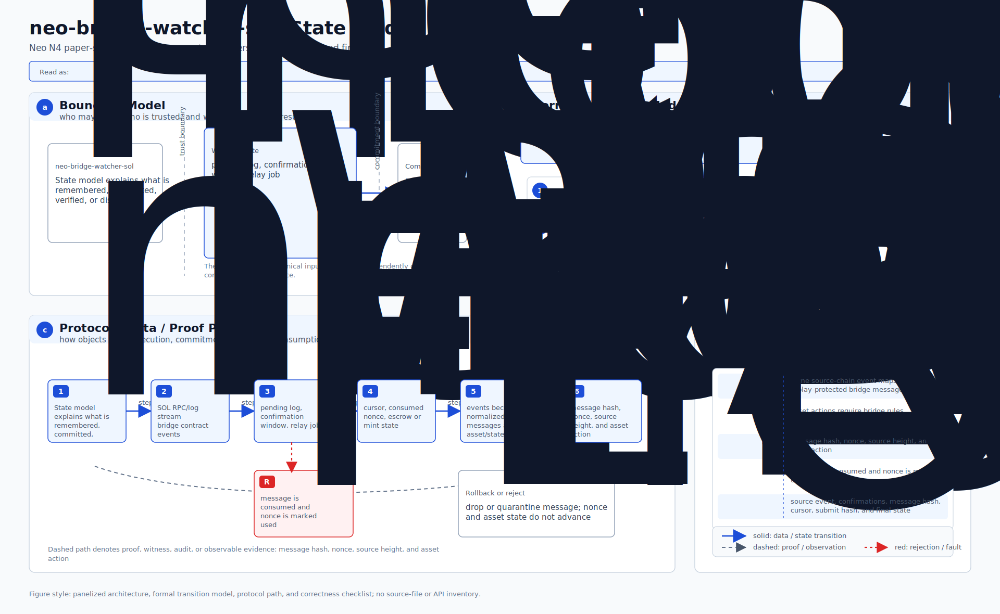
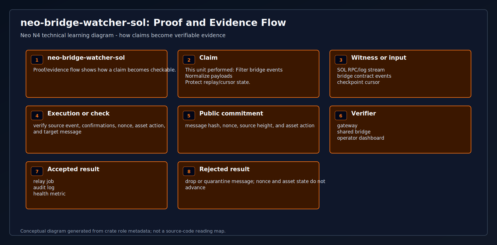
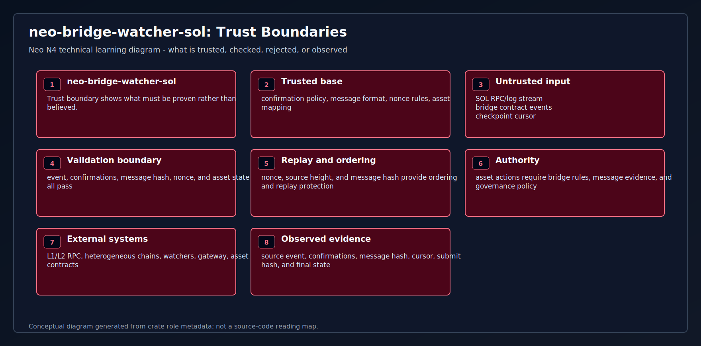
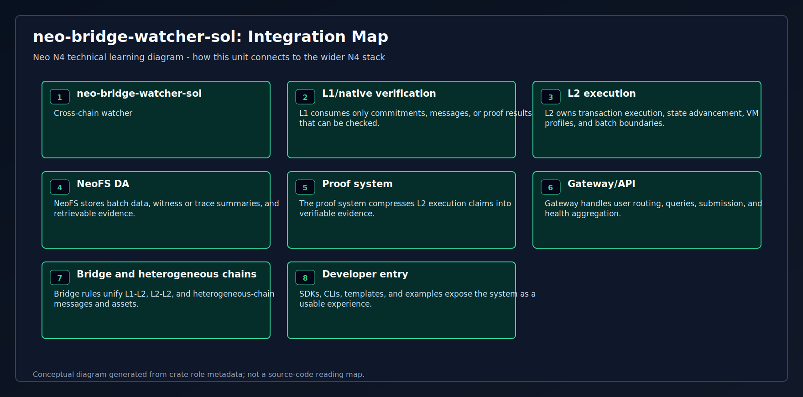
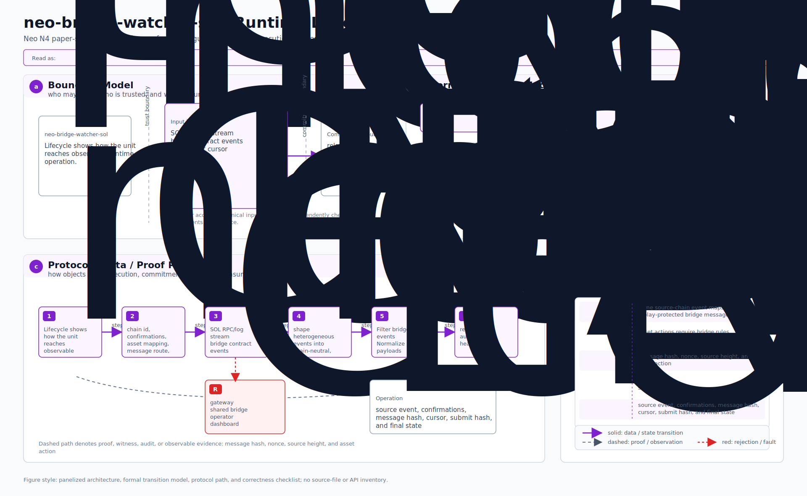

# neo-bridge-watcher-sol

<!-- N4-CRATE-VISUAL-GUIDE:START -->
## Technical Visual Guide

These diagrams are local to this crate and explain `neo-bridge-watcher-sol` at the technical architecture level. They focus on system role, principles, data movement, workflow, state, proof/evidence, trust boundaries, integration, and runtime lifecycle.

Full technical explanation: [docs/learning-guide.md](docs/learning-guide.md).

| View | Diagram | Mermaid |
| --- | --- | --- |
| System Position |  | [Mermaid](docs/figures/position.mmd) |
| Technical Principles |  | [Mermaid](docs/figures/principles.mmd) |
| Conceptual Architecture |  | [Mermaid](docs/figures/architecture.mmd) |
| Workflow |  | [Mermaid](docs/figures/workflow.mmd) |
| Data Flow |  | [Mermaid](docs/figures/dataflow.mmd) |
| State Model |  | [Mermaid](docs/figures/state-model.mmd) |
| Proof and Evidence Flow |  | [Mermaid](docs/figures/proof-flow.mmd) |
| Trust Boundaries |  | [Mermaid](docs/figures/trust-boundaries.mmd) |
| Integration Map |  | [Mermaid](docs/figures/integration-map.mmd) |
| Runtime Lifecycle |  | [Mermaid](docs/figures/lifecycle.mmd) |

### Technical Role

- **Layer:** Cross-chain watcher
- **Purpose:** Observes SOL bridge events and turns them into normalized Neo N4 relay messages.
- **Inputs:** SOL RPC/log stream | bridge contract events | checkpoint cursor
- **Responsibilities:** Filter bridge events | Normalize payloads | Protect replay/cursor state
- **Outputs:** relay job | audit log | health metric
- **Consumers:** gateway | shared bridge | operator dashboard

### Reading Order

1. Start with system position and conceptual architecture.
2. Read technical principles, trust boundaries, and state model to understand correctness.
3. Follow workflow and dataflow to see runtime movement.
4. Use proof/evidence flow, integration map, and lifecycle for operational understanding.
<!-- N4-CRATE-VISUAL-GUIDE:END -->
