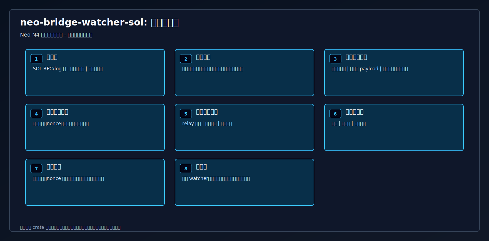
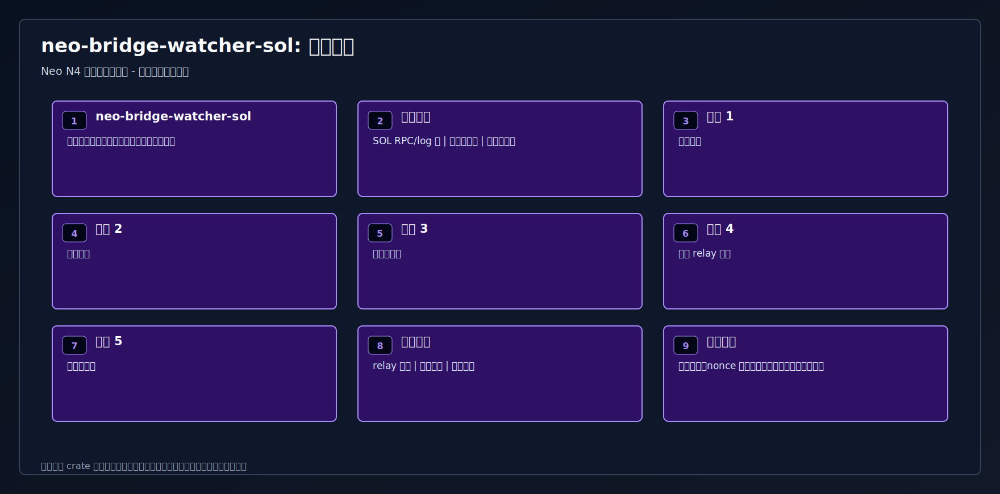
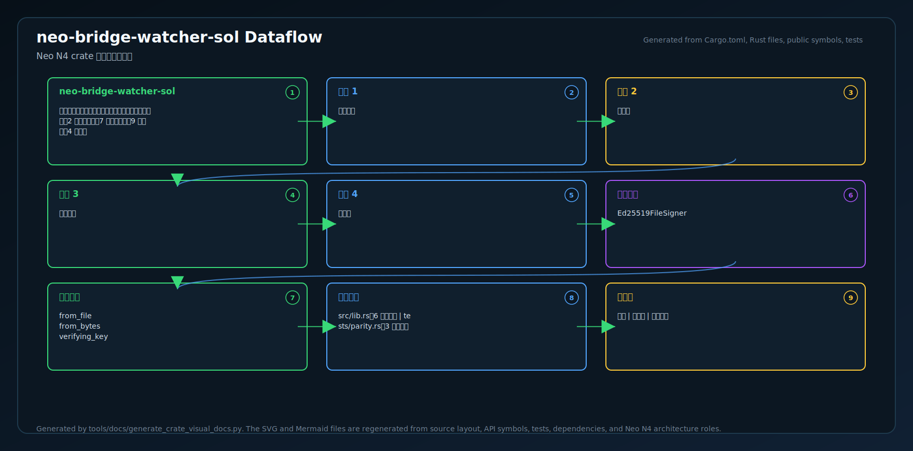

# neo-bridge-watcher-sol

<!-- N4-CRATE-VISUAL-GUIDE-ZH:START -->

## 可视化架构学习指南

这些图用于说明 `neo-bridge-watcher-sol` 在 Neo N4 栈中的位置、主要工作流，以及数据如何流经该 crate。

| 视图 | 图片 | 源文件 |
| --- | --- | --- |
| 架构 |  | [Mermaid](docs/figures/architecture.zh.mmd) |
| 工作流 |  | [Mermaid](docs/figures/workflow.zh.mmd) |
| 数据流 |  | [Mermaid](docs/figures/dataflow.zh.mmd) |

### 在 Neo N4 中的作用

- **层级:** 跨链监听器
- **目的:** 监听 SOL 桥事件，并转换为标准化 Neo N4 relay 消息。
- **主要输入:** SOL RPC/log 流、桥合约事件、检查点游标
- **主要输出:** relay 任务、审计日志、健康指标
- **下游消费者:** 网关、共享桥、运维面板

### 学习路径

1. 先看架构图，理解 crate 的边界和所在层级。
2. 再看工作流图，理解正常执行路径。
3. 最后看数据流图，把输入、状态变化和输出串起来。
4. 带着图中的上下文阅读源码，会更容易理解模块职责。

<!-- N4-CRATE-VISUAL-GUIDE-ZH:END -->
